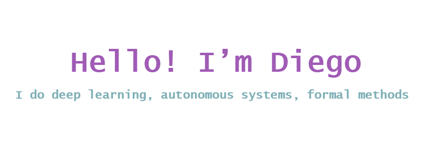

#### About me

- 💼 Research Scientist at the [VeriVITAL](http://www.taylortjohnson.com/) group at Vanderbilt University.

- 📈 Over 20 [publications](https://scholar.google.com/citations?user=kgpZCIAAAAAJ&hl=en)

- 🤵 Developer of the open source Neural Network Verification Tool, [NNV](https://github.com/verivital/nnv)

- ❤️ Python, MATLAB and tennis

|  |  |
| ------------- | ------------- |
